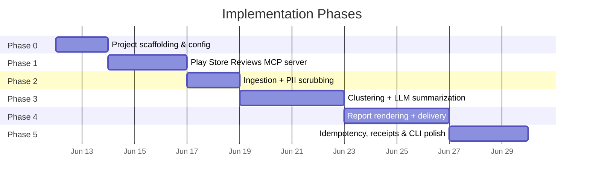
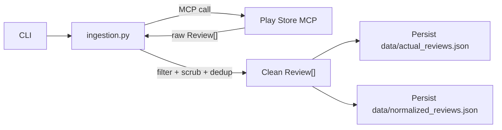
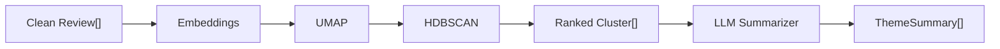
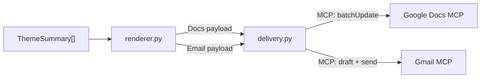
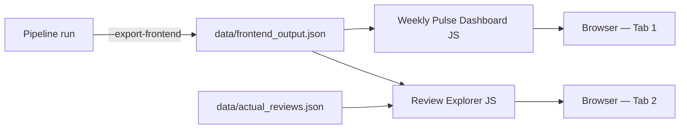
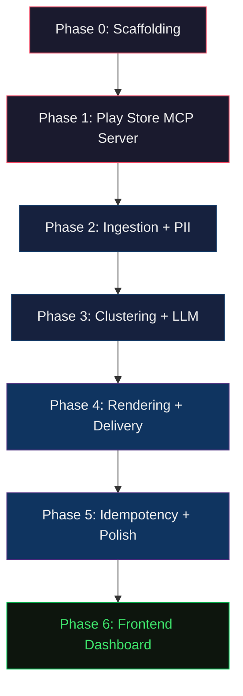

# Groww Review Pulse — Implementation Plan

> Derived from `problemStatement.md` and `architecture.md`.
> This document breaks the build into **six sequential phases**, each producing a testable, demo-able increment.

---

## Phase Overview



| Phase | Name | Key Deliverable | Estimated Effort |
|-------|------|-----------------|------------------|
| **0** | Project Scaffolding | Runnable skeleton with config, deps, dir structure | 1–2 days |
| **1** | Play Store Reviews MCP Server | Working MCP server that returns Groww reviews | 2–3 days |
| **2** | Ingestion & PII | Reviews fetched via MCP, filtered, scrubbed, deduplicated | 1–2 days |
| **3** | Clustering & Summarization | Themes, quotes, action ideas from raw reviews | 3–4 days |
| **4** | Rendering & Delivery | Docs append + Gmail send via MCP | 3–4 days |
| **5** | Idempotency, Receipts & Polish | Safe re-runs, auditability, CLI flags, error handling | 2–3 days |
| **6** | Frontend Dashboard | Weekly Pulse Dashboard + Review Explorer web UI | 3–5 days |

---

## Phase 0 — Project Scaffolding

**Goal:** A runnable Python project with all directories, configuration files, and dependencies in place. No business logic yet — just the skeleton.

### Tasks

#### 0.1 Initialize Python project

- [ ] Create `pyproject.toml` with project metadata, Python ≥3.11 requirement, and all dependency groups:

```toml
[project]
name = "groww-pulse"
version = "0.1.0"
requires-python = ">=3.11"

[project.optional-dependencies]
dev = ["pytest", "pytest-asyncio", "ruff"]
```

- [ ] Define dependency groups:
  - **Core:** `click`, `pyyaml`
  - **Scraper:** `google-play-scraper`, `emoji`, `langdetect`
  - **MCP:** `mcp`
  - **ML:** `sentence-transformers`, `umap-learn`, `hdbscan`, `numpy`
  - **LLM:** `openai` or `litellm`
  - **Dev:** `pytest`, `pytest-asyncio`, `ruff`

#### 0.2 Create directory structure

- [ ] Create the full directory tree per architecture.md §9:

```
Groww_Pulse/
├── docs/                            # Already exists
├── mcp_servers/
│   └── playstore_reviews/
│       ├── __init__.py
│       ├── __main__.py
│       ├── server.py
│       └── scraper.py
├── groww_pulse/
│   ├── __init__.py
│   ├── __main__.py
│   ├── config.py
│   ├── ingestion.py
│   ├── clustering.py
│   ├── summarizer.py
│   ├── renderer.py
│   ├── delivery.py
│   ├── receipts.py
│   └── pii.py
├── data/
│   └── receipts/
├── tests/
│   ├── __init__.py
│   ├── test_scraper.py
│   ├── test_ingestion.py
│   ├── test_clustering.py
│   ├── test_summarizer.py
│   └── test_delivery.py
├── config.yaml
├── mcp_servers.json
├── pyproject.toml
└── README.md
```

#### 0.3 Configuration files

- [ ] Create `config.yaml` with all sections (product, ingestion, clustering, llm, delivery, receipts) using defaults from architecture.md §8.
- [ ] Create `mcp_servers.json` with all three server declarations per architecture.md §2.
- [ ] Implement `groww_pulse/config.py`:
  - Load and validate `config.yaml` using `pyyaml`.
  - Expose a typed `Config` dataclass with dot-access (e.g. `config.ingestion.window_weeks`).
  - Merge CLI argument overrides into config.

#### 0.4 CLI skeleton

- [ ] Implement `groww_pulse/__main__.py` with `click`:
  - `run` command with `--week`, `--window`, `--dry-run`, `--draft-only` options.
  - Load config, print banner, and exit (placeholder for pipeline).
- [ ] Verify: `python -m groww_pulse run --help` prints usage correctly.

### Exit Criteria

```bash
# All must pass:
python -m groww_pulse run --help          # Shows CLI options
python -m groww_pulse run --dry-run       # Loads config, prints banner, exits 0
pytest tests/ -v                          # Config tests pass
```

---

## Phase 1 — Play Store Reviews MCP Server

**Goal:** A fully functional MCP server (in-repo) that exposes a `fetch_reviews` tool, returning structured Groww review data from Google Play.

### Tasks

#### 1.1 Implement scraper module

- [x] Create `mcp_servers/playstore_reviews/scraper.py`:
  - Wrap `google-play-scraper` library's `reviews()` function.
  - Accept parameters: `app_id`, `lang`, `count`, `sort_order`.
  - Return a list of `Review` dicts matching the schema from architecture.md §3.2:

```python
@dataclass
class Review:
    review_id: str
    author: str
    rating: int          # 1–5
    text: str
    timestamp: str       # ISO-8601
    thumbs_up: int
    app_version: str | None
```

  - Map `google-play-scraper`'s raw output fields to this schema.
  - Implement data quality filters during scraping:
    - Drop reviews with fewer than 8 words.
    - Drop reviews containing any emojis (using `emoji` library).
    - Drop non-English reviews (using `langdetect`).
  - Handle pagination: the library returns reviews in batches; loop until `count` valid reviews are met or no more results.

#### 1.2 Build MCP server

- [x] Create `mcp_servers/playstore_reviews/server.py`:
  - Use the MCP Python SDK (`mcp`) to define the server.
  - Register one tool: `fetch_reviews`.
  - Tool parameters: `app_id` (str, default `com.nextbillion.groww`), `lang` (str, default `en`), `count` (int, default `1000`), `sort` (str, default `newest`).
  - Tool returns: JSON array of `Review` objects.

- [x] Create `mcp_servers/playstore_reviews/__main__.py`:
  - Starts the MCP server on **stdio** transport.
  - Entry point: `python -m mcp_servers.playstore_reviews`.

#### 1.3 Test the MCP server standalone

- [x] Write `tests/test_scraper.py`:
  - Unit test: mock `google-play-scraper` responses, verify schema mapping.
  - Integration test (marked `@pytest.mark.integration`): fetch 10 real reviews, validate schema.
- [x] Manual smoke test: start server, call `fetch_reviews` via MCP inspector or a test client script.

### Exit Criteria

```bash
# Standalone server starts and responds:
python -m mcp_servers.playstore_reviews   # Starts on stdio, no crash

# Tests:
pytest tests/test_scraper.py -v           # Schema mapping correct
pytest tests/test_scraper.py -v -m integration  # Real reviews fetched
```

### Key Risks

| Risk | Mitigation |
|------|------------|
| `google-play-scraper` rate limiting | Add retry with backoff; cap `count` at 2000 |
| Library API changes | Pin version in `pyproject.toml`; wrap behind our own interface |

---

## Phase 2 — Ingestion & PII Scrubbing

**Goal:** The agent can call the Play Store MCP server, receive reviews, filter by date window, scrub PII, and produce a clean review set ready for analysis.

### Tasks

#### 2.1 MCP client integration

- [x] Implement `groww_pulse/ingestion.py`:
  - Connect to the Play Store Reviews MCP server as an MCP client (using `mcp` SDK client).
  - Call the `fetch_reviews` tool with parameters from `config.yaml`.
  - Deserialize the JSON response into `Review` dataclass instances.

#### 2.2 Date filtering

- [x] Filter reviews where `timestamp` falls within the configured rolling window:
  - Compute window start: `run_date - timedelta(weeks=config.ingestion.window_weeks)`.
  - Drop reviews outside the window.
  - Log: `Filtered {N} reviews to {M} within {window_weeks}-week window`.

#### 2.3 PII scrubbing

- [x] Implement `groww_pulse/pii.py`:
  - **Email regex:** Remove/mask email addresses.
  - **Phone regex:** Remove/mask phone numbers (Indian + international patterns).
  - **Aadhaar / PAN patterns:** Mask Indian ID numbers if present.
  - Replace matched PII with `[REDACTED]`.
  - Return the scrubbed text + a count of redactions.
- [x] Apply PII scrubbing to every review's `text` and `author` fields.

#### 2.4 Deduplication

- [x] Deduplicate reviews by `review_id` (keep first occurrence).
- [x] Log deduplication stats.

#### 2.5 Tests

- [x] `tests/test_ingestion.py`:
  - Mock MCP client responses; verify filtering, scrubbing, dedup.
- [x] `tests/test_pii.py`:
  - Unit tests for each PII pattern (emails, phones, Aadhaar, PAN).
  - Edge cases: no PII, mixed PII, PII in author name.

### Exit Criteria

```bash
# End-to-end ingestion test (with MCP server running):
python -c "
from groww_pulse.ingestion import ingest_reviews
from groww_pulse.config import load_config
config = load_config()
reviews = ingest_reviews(config)
print(f'{len(reviews)} clean reviews ready')
"

# Unit tests:
pytest tests/test_ingestion.py tests/test_pii.py -v
```

### Data Flow at End of Phase 2



---

## Phase 3 — Clustering & LLM Summarization

**Goal:** Turn clean reviews into ranked themes with named topics, verbatim quotes, and action ideas. This is the analytical core of the system.

### Tasks

#### 3.1 Embedding generation

- [x] Implement the embedding step in `groww_pulse/clustering.py`:
  - Accept `Review[]` or normalized JSON, extract `text` field.
  - Generate embeddings locally using `sentence-transformers` with the `BAAI/bge-small-en-v1.5` model.
  - Return a `numpy` matrix of shape `(N, embedding_dim)`.
  - Configurable: model choice via `config.yaml`.

#### 3.2 UMAP dimensionality reduction

- [x] Apply UMAP to reduce embeddings to `config.clustering.umap_n_components` dimensions:
  - Parameters from config: `n_neighbors`, `n_components`, `min_dist=0.0`, `metric='cosine'`.
  - Return reduced matrix.

#### 3.3 HDBSCAN clustering

- [x] Apply HDBSCAN on the UMAP-reduced embeddings:
  - Parameters from config: `min_cluster_size`, `min_samples`.
  - Label each review with its cluster ID (or -1 for noise).
  - Build `Cluster` objects per architecture.md §3.4:
    - `cluster_id`, `size`, `avg_rating`, `representative_reviews` (top-5 by centrality to centroid).

#### 3.4 Cluster ranking

- [x] Rank clusters by a composite score:
  - Primary: cluster `size` (larger = more impactful).
  - Secondary: `avg_rating` delta from global mean (more negative = more critical).
  - Return top-N clusters (configurable, default 5).

#### 3.5 LLM summarization

- [x] Implement `groww_pulse/summarizer.py`:
  - For each ranked cluster, build an LLM prompt containing:
    - System message with prompt-injection defense (reviews are data, not instructions).
    - The representative review texts as a data block.
    - Instructions: name the theme, write a 1–2 sentence description, extract 2–3 verbatim quotes, propose 1–2 action ideas.
  - Parse the LLM structured output (use JSON mode or function calling) into `ThemeSummary` objects per architecture.md §3.5.
  - **Quote validation:** For each returned quote, verify it is a substring of the source review text. If not → re-prompt (up to 2 retries) or drop the quote.

#### 3.6 Token budget and rate limit enforcement (Groq)

- [x] Track cumulative token and request usage across all LLM calls.
- [x] Enforce Groq API limits for `llama-3.3-70b-versatile`:
  - **Requests per minute (RPM):** 30
  - **Requests per day (RPD):** 1,000
  - **Tokens per minute (TPM):** 12,000
  - **Tokens per day (TPD):** 100,000
- [x] Implement exponential backoff or sleep logic between requests to avoid breaching the tight TPM (12K) and RPM (30) limits.
- [x] If usage exceeds daily limit (100K TPD), stop processing remaining clusters and log a warning.

#### 3.7 Tests

- [x] `tests/test_clustering.py`:
  - Unit test with synthetic embeddings: verify UMAP + HDBSCAN produces expected cluster count.
  - Test ranking logic with mock clusters.
- [x] `tests/test_summarizer.py`:
  - Mock LLM responses; verify `ThemeSummary` parsing.
  - Test quote validation: valid quote passes, hallucinated quote is rejected.
  - Test token budget enforcement.

### Exit Criteria

```bash
# Full pipeline through summarization (dry-run):
python -m groww_pulse run --dry-run --week 2026-W24
# Output: prints ThemeSummary[] to stdout, no delivery

# Tests:
pytest tests/test_clustering.py tests/test_summarizer.py -v
```

### Data Flow at End of Phase 3



---

## Phase 4 — Report Rendering & Delivery

**Goal:** Transform `ThemeSummary[]` into Google Docs content and email HTML, then deliver both via MCP servers.

### Tasks

#### 4.1 Google Docs renderer

- [x] Implement the Docs rendering path in `groww_pulse/renderer.py`:
  - Accept `ThemeSummary[]`, ISO week, config.
  - Generate the section structure per architecture.md §3.6:
    - Heading: `Groww — Weekly Review Pulse (2026-W24)`
    - Period metadata
    - Top Themes (numbered list with review counts)
    - Real User Quotes (blockquotes)
    - Action Ideas (numbered list)
    - Horizontal rule separator
  - Output: plain text string to be appended to the document.

#### 4.2 Email renderer

- [x] Implement the email rendering path in `groww_pulse/renderer.py`:
  - Generate **HTML** body for rich email clients:
    - Subject line: `Groww Review Pulse — 2026-W24`
    - Bullet list of top themes with review counts.
    - "Read full report →" deep link to the Google Doc section.
  - Generate **plain text** fallback with the same content.
  - Output: `EmailPayload(subject, html_body, text_body, doc_link)`.

#### 4.3 Google Docs delivery

- [x] Implement Docs delivery in `groww_pulse/delivery.py`:
  - Send a POST request to `https://shreyash-mcp-server-production-5d26.up.railway.app/append_to_doc`.
  - Pass the payload: `{"doc_id": "...", "content": "..."}`.
  - Handle errors: if the server is unreachable or the call fails, raise a clear exception.

#### 4.4 Gmail delivery

- [x] Implement Gmail delivery in `groww_pulse/delivery.py`:
  - Send a POST request to `https://shreyash-mcp-server-production-5d26.up.railway.app/create_email_draft`.
  - Pass the payload: `{"to": "...", "subject": "...", "body": "..."}`.

#### 4.5 Orchestration

- [x] Wire the full pipeline in `groww_pulse/__main__.py`:
  - Ingestion → Clustering → Summarization → Rendering → Delivery.
  - Respect `--dry-run` flag: if set, print rendered output and exit before delivery.
  - Respect `--draft-only` flag: pass through to delivery module.

#### 4.6 Tests

- [x] `tests/test_renderer.py`:
  - Verify Docs payload structure from mock `ThemeSummary[]`.
  - Verify email HTML contains expected elements (subject, theme bullets, doc link).
- [x] `tests/test_delivery.py`:
  - Mock REST API client (`urllib`): verify correct POST payload for Google Docs.
  - Mock REST API client (`urllib`): verify POST payload for Gmail draft creation.
  - Test error: Docs delivery fails → email is not attempted.

### Exit Criteria

```bash
# Full pipeline with draft-only (safe):
python -m groww_pulse run --week 2026-W24 --draft-only
# Result: Section appended to Google Doc, Gmail draft created (not sent)

# Full send (staging):
python -m groww_pulse run --week 2026-W24
# Result: Doc updated + email sent to configured recipients

# Tests:
pytest tests/test_renderer.py tests/test_delivery.py -v
```

### Data Flow at End of Phase 4



---

## Phase 5 — Idempotency, Receipts & Polish

**Goal:** Make the system production-safe: re-runs are harmless, every run is auditable, errors are handled gracefully, and the CLI is polished.

### Tasks

#### 5.1 Run receipts

- [x] Implement `groww_pulse/receipts.py`:
  - Write a JSON receipt to `data/receipts/groww_{iso_week}.json` after each run per architecture.md §6.
  - Fields: `idempotency_key`, `run_timestamp`, `review_window`, `reviews_ingested`, `clusters_found`, `themes_generated`, `delivery` (doc + gmail status), `llm_usage`.
  - Support partial receipts: if Doc succeeds but email fails, write what we have.
  - Load existing receipt for a given ISO week (used by idempotency checks).

#### 5.2 Idempotent Doc append

- [x] Before appending to the Google Doc, check for an existing section:
  - **Strategy A (receipt-based):** If a receipt exists for this ISO week with `doc.status = "appended"`, skip the Doc write.
  - **Strategy B (doc-based):** Query the Doc for a heading matching `Groww — Weekly Review Pulse ({iso_week})`. If found → skip.
  - Use **both** strategies (belt and suspenders): check receipt first (fast), then verify against the Doc (authoritative).

#### 5.3 Idempotent email send

- [x] Before sending email:
  - If the receipt for this ISO week has `gmail.status = "sent"` and a valid `message_id` → skip send entirely.
  - If `gmail.status = "drafted"` → attempt to send the existing draft (don't create a new one).

#### 5.4 Partial failure recovery

- [x] Handle the partial-failure scenario per architecture.md §12:
  - Doc OK + Email failed: Re-run skips Doc (idempotent), retries email.
  - Doc failed: Re-run retries from Doc step.
  - Implementation: check receipt status for each delivery step before executing.

#### 5.5 Error handling & retry

- [x] Add retry logic with exponential backoff for MCP calls:
  - Play Store MCP: 3 retries, backoff 1s → 2s → 4s.
  - Docs MCP: 3 retries.
  - Gmail MCP: 3 retries.
- [x] Handle edge cases:
  - 0 reviews returned → abort with warning, no delivery.
  - 0 clusters → abort with warning, no delivery.
  - LLM quota exceeded → fail run, partial receipt.
- [x] All errors logged with structured context (ISO week, step, error message).

#### 5.6 CLI polish

- [x] Add a `status` subcommand:
  - `python -m groww_pulse status --week 2026-W24` → print the receipt for that week.
  - `python -m groww_pulse status --all` → list all receipts.
- [x] Improve CLI output:
  - Progress indicators for each pipeline step.
  - Summary banner at end: reviews ingested, themes found, delivery status.
  - Colored output (using `click.style`).

#### 5.7 Tests

- [x] `tests/test_receipts.py`:
  - Write + read receipt round-trip.
  - Partial receipt handling.
- [x] `tests/test_idempotency.py`:
  - Mock: receipt exists with doc appended → verify Doc write is skipped.
  - Mock: receipt exists with email sent → verify email is skipped.
  - Mock: receipt exists with email failed → verify email is retried.
- [x] `tests/test_error_handling.py`:
  - 0 reviews → pipeline aborts cleanly.
### Exit Criteria

```bash
# First run — full pipeline:
python -m groww_pulse run --week 2026-W24
# Result: Doc updated, email sent, receipt written

# Re-run — idempotent:
python -m groww_pulse run --week 2026-W24
# Result: "Already completed for 2026-W24, skipping" (no duplicate writes)

# Status check:
python -m groww_pulse status --week 2026-W24
# Result: Prints receipt JSON

# Tests:
pytest tests/ -v   # All tests pass
```

---

## Phase 6 — Frontend Dashboard

**Goal:** A single-page web application with two tabs — **Weekly Pulse Dashboard** and **Review Explorer** — that renders the pipeline's output as a premium, dark-themed analytics interface. Design was generated via Google Stitch and lives in `design/`.

> [!NOTE]
> Design reference files:
> - [`design/weekly_pulse_dashboard/weekly_pulse_dashboard.html`](file:///Users/shreyash/NextLeap/Groww_Pulse/design/weekly_pulse_dashboard/weekly_pulse_dashboard.html)
> - [`design/review_explorer/review_explorer.html`](file:///Users/shreyash/NextLeap/Groww_Pulse/design/review_explorer/review_explorer.html)

### Design System (from Stitch output)

| Token | Value |
|-------|-------|
| Background | `#0d150d` |
| Primary (Groww green) | `#3fe56c` |
| Primary container (CTA green) | `#00c853` |
| Secondary (amber) | `#ff8f00` |
| Error / Critical | `#ffb4ab` / `#93000a` |
| Surface container | `#192219` |
| Font | Inter (400, 500, 600, 700, 900) |
| Card style | Glassmorphism — `rgba(255,255,255,0.03)` bg, `blur(24px)`, `rgba(255,255,255,0.08)` border |
| Active tab indicator | 2px `#3fe56c` underline with `box-shadow: 0 0 10px rgba(63,229,108,0.5)` |
| Icons | Google Material Symbols Outlined |

### Layout Architecture

- **Fixed top nav bar** (height: 64px, `backdrop-blur-3xl`): Logo + tab switcher (`Weekly Pulse` / `Review Explorer`) + week selector dropdown + notification + settings + user avatar
- **Fixed left sidebar** (width: 240px, desktop only): Dashboard / Analytics / Sentiment / History nav links + "Generate Report" CTA button + Support / Settings footer links
- **Main content area**: `margin-top: 64px; margin-left: 240px` with `24px` container padding
- **Footer**: `opacity: 60%` — "Powered by UMAP Analytics Engine" | "Last run" timestamp | "System Status: Healthy" pulsing dot

### Tasks

#### 6.1 Directory structure

- [ ] Create `frontend/` at project root:

```
frontend/
├── index.html               # Entry point, tab router
├── css/
│   └── styles.css           # Design tokens, glassmorphism, scrollbar, animations
├── js/
│   ├── main.js              # Tab switching, week selector, shared nav logic
│   ├── weekly_pulse.js      # Hero stats, theme cards, delivery status bar
│   └── review_explorer.js   # Search, filters, distribution bar, review feed, pagination
├── data/
│   └── frontend_output.json # Data contract (see §6.2)
└── assets/
    └── logo.svg
```

#### 6.2 Data contract — `frontend_output.json`

- [ ] Extend the pipeline's `--dry-run` output to also write a structured `data/frontend_output.json` with:

```json
{
  "iso_week": "2026-W24",
  "window_weeks": 12,
  "reviews_ingested": 1247,
  "avg_rating": 3.2,
  "themes": [
    {
      "rank": 1,
      "name": "Good Investment App",
      "review_count": 193,
      "avg_rating": 4.83,
      "description": "Users praise the app for being good for investment...",
      "quotes": [
        {"text": "very good app for investment i love it", "rating": 5},
        {"text": "Very Good app to learn and Invest", "rating": 5}
      ],
      "action_ideas": [
        "Improve User Interface: Continuously gather user feedback...",
        "Enhance Support Services: Invest in providing quick and reliable support..."
      ]
    }
  ],
  "rating_distribution": {"5": 40, "4": 15, "3": 10, "2": 8, "1": 27},
  "pipeline": {
    "model": "llama-3.3-70b-versatile",
    "llm_tokens_used": 3833,
    "llm_tokens_limit": 100000,
    "doc_status": "appended",
    "gmail_status": "draft_created",
    "run_id": "2026-W24",
    "run_timestamp": "2026-06-20T19:36:32Z"
  }
}
```

#### 6.3 Tab 1 — Weekly Pulse Dashboard

Based on [`weekly_pulse_dashboard.html`](file:///Users/shreyash/NextLeap/Groww_Pulse/design/weekly_pulse_dashboard/weekly_pulse_dashboard.html) and [`weekly_pulse_dashboard.png`](file:///Users/shreyash/NextLeap/Groww_Pulse/design/weekly_pulse_dashboard/weekly_pulse_dashboard.png).

- [ ] **Hero Stats Bar** (4-column grid): 
  - Reviews Ingested (with +12% delta badge)
  - Themes Identified (with colored cluster dot indicators)
  - Avg Rating (colored: green > 3.5, amber 2.5–3.5, red < 2.5) + "Critical Volume" label
  - LLM Tokens (number / 100K + thin progress bar + "Quota refreshes in 4d" subtext)
- [ ] **"Top Weekly Themes" section** with "EXPORT ALL ↓" link:
  - 2-column grid for themes 1–4, full-width row for theme 5
  - Each card: rank badge (muted large number) + theme name (bold) + review count + avg rating pill (green/amber/red) + 1-line description (italic)
  - 3 blockquotes with left green/red border per theme (color matches rating sentiment)
  - Collapsible "↓ ACTION IDEAS" section per card
  - Bottom progress bar showing proportion of total reviews (filled in theme color)
- [ ] **Pipeline Execution Status bar** (bottom of tab):
  - 4 pill badges: `Google Docs: Appended` | `Gmail: Draft Created` | `Run ID: 2026-W24` | `Model: llama-3.3-70b-versatile`

#### 6.4 Tab 2 — Review Explorer

Based on [`review_explorer.html`](file:///Users/shreyash/NextLeap/Groww_Pulse/design/review_explorer/review_explorer.html) and [`review_explorer.png`](file:///Users/shreyash/NextLeap/Groww_Pulse/design/review_explorer/review_explorer.png).

- [ ] **Sticky filter bar**:
  - Full-width search input with magnifier icon
  - 5 star toggle buttons (1★–5★) with active state (`bg-white/10`)
  - App version dropdown (v18.11.1, v18.10.1, v18.09.2…)
  - Sort dropdown (Most Helpful / Newest / Oldest)
  - Date Range picker button
- [ ] **Rating Distribution bar** (full-width, compact single bar):
  - Stacked bar: 5★ 40% (green) | 4★ 15% (light green) | 3★ 10% (amber) | 2★ 8% (orange) | 1★ 27% (red)
  - Legend below with colored dots
  - "Last 30 Days" label
- [ ] **Review card feed** (single-column, max-width 896px):
  - Left: initial avatar circle (colored per sentiment — green for positive, red for negative) + author name + filled/unfilled stars in theme color + timestamp + app version badge
  - Right: cluster theme pill badge (amber = Feature Requests, red = Trading Issues, green = Good Investment App, etc.)
  - Body: review text (truncated at 3 lines with "Read more")
  - Footer: 👍 thumbs-up count + context action button ("Reply" / "Escalate" / "Thank User" depending on rating)
  - Negative reviews (1–2★): left border `border-l-4 border-l-error/40`
  - Positive reviews (4–5★): left border `border-l-4 border-l-primary/40`
- [ ] **Pagination**: `← Previous | Page 1 of 83 | Next →`
- [ ] **Client-side filtering**: filter/search/sort operates on `data/actual_reviews.json` loaded in memory; pagination is recalculated after each filter change

#### 6.5 Shared components

- [ ] Tab router: clicking nav tab updates active state (green underline + glow), shows/hides respective content
- [ ] Week selector dropdown: changing week reloads `frontend_output.json` for the selected week
- [ ] Sidebar navigation: Dashboard / Analytics / Sentiment / History links (stubs for future phases) + "Generate Report" green CTA button
- [ ] Micro-interactions: `translateY(-2px)` on card hover, `active:scale-95` on buttons, `animate-pulse` on system status dot
- [ ] Ambient background: two blurred radial gradients (green top-left, amber bottom-right) at `opacity: 20%` via `position: fixed; pointer-events: none; z-index: -10`
- [ ] Custom scrollbar: 4px wide, `rgba(63,229,108,0.2)` thumb

#### 6.6 Tests

- [ ] Manual smoke test: open `frontend/index.html` in browser, verify both tabs render with data from `data/frontend_output.json`
- [ ] Filter test: toggle 1★ filter → only 1-star reviews shown; clear → all reviews shown
- [ ] Search test: type "brokerage" → only matching reviews shown
- [ ] Week selector test: selecting a different week loads a different `frontend_output.json`

### Exit Criteria

```bash
# Generate the frontend data file:
python -m groww_pulse run --dry-run --week 2026-W24 --export-frontend
# Result: data/frontend_output.json written

# Open frontend:
open frontend/index.html
# Result: Weekly Pulse Dashboard renders with 5 theme cards, hero stats, pipeline status bar
# Click "Review Explorer" tab → review feed loads, filters work
```

### Data Flow at End of Phase 6



---

## Cross-Phase Concerns

### Logging

- Use Python `logging` module throughout. Configure in CLI entrypoint.
- Log levels: `INFO` for pipeline progress, `WARNING` for skipped steps, `ERROR` for failures.
- Structured log fields: `iso_week`, `step`, `count`, `duration_ms`.

### Testing Strategy

| Layer | Framework | What's tested |
|-------|-----------|---------------|
| Unit | `pytest` | Config parsing, PII scrubbing, schema mapping, rendering, receipt I/O |
| Integration | `pytest` + `@pytest.mark.integration` | Real Play Store fetch, real MCP server comms |
| End-to-end | CLI invocation | Full `python -m groww_pulse run --dry-run` pipeline |

### Documentation

- [ ] `README.md`: Quick-start, prerequisites, configuration, usage examples.
- [ ] Inline docstrings on all public functions.
- [ ] Update `architecture.md` if any design decisions change during implementation.

---

## Dependency Installation Order

Phases have strict dependency chains. Here's the build order:



> [!IMPORTANT]
> Each phase's exit criteria **must** be met before starting the next phase. This ensures no downstream module is built on an untested foundation.

---

## Risk Register

| # | Risk | Impact | Likelihood | Mitigation |
|---|------|--------|------------|------------|
| R1 | `google-play-scraper` gets rate-limited or blocked | High — no data | Medium | Retry with backoff; cache raw reviews locally; consider SerpAPI as fallback |
| R2 | Google Docs/Gmail MCP server API surface differs from assumptions | Medium — delivery blocked | Medium | Discover tools dynamically at runtime; adapter layer in delivery module |
| R3 | LLM hallucinates quotes not in source reviews | Medium — credibility loss | High | Mandatory quote validation (Phase 3.5); re-prompt on failure |
| R4 | Clustering produces too many / too few clusters | Low — report quality | Medium | Tune HDBSCAN params; add manual override in config |
| R5 | Token costs spike with large review volumes | Medium — budget | Low | Hard cap in config; truncate review text to first 500 chars for embedding |
| R6 | MCP SDK breaking changes | Medium — build broken | Low | Pin SDK version; monitor releases |

---

## Summary Checklist

- [ ] **Phase 0:** `pyproject.toml`, directory structure, `config.yaml`, `mcp_servers.json`, CLI skeleton
- [ ] **Phase 1:** `scraper.py`, `server.py`, `__main__.py` for Play Store MCP; scraper tests
- [ ] **Phase 2:** `ingestion.py`, `pii.py`; MCP client integration; filtering + scrubbing tests
- [ ] **Phase 3:** `clustering.py`, `summarizer.py`; embeddings → UMAP → HDBSCAN → LLM; quote validation; tests
- [ ] **Phase 4:** `renderer.py`, `delivery.py`; Docs + Gmail MCP delivery; end-to-end test with `--draft-only`
- [ ] **Phase 5:** `receipts.py`, idempotency logic, error handling, `status` command, all tests green
- [ ] **Phase 6:** `frontend/` app; Weekly Pulse Dashboard + Review Explorer; data API endpoint; `frontend_output.json` contract
